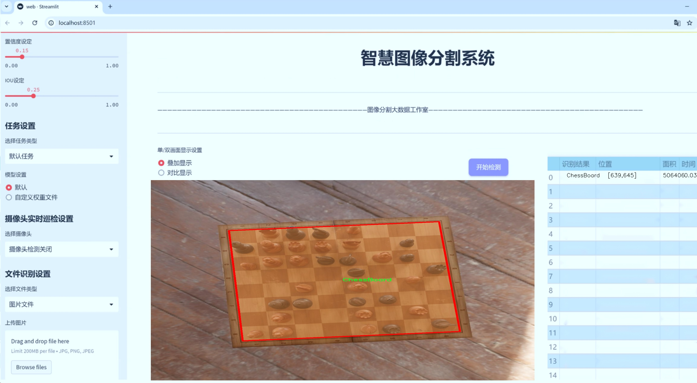
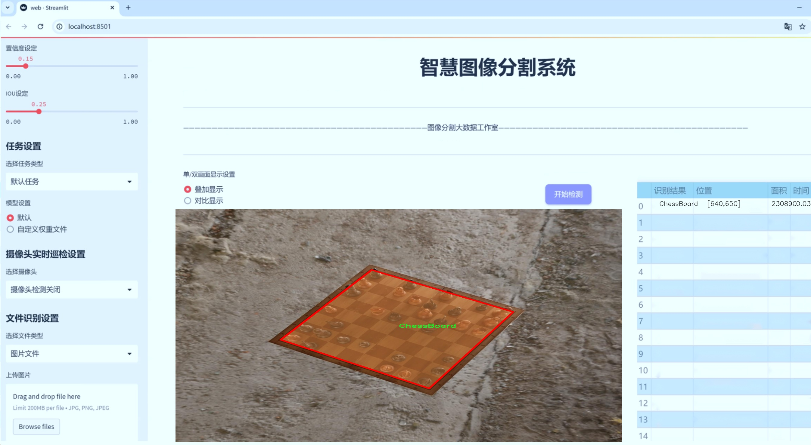
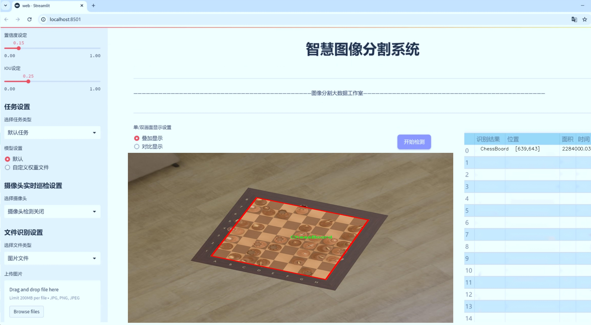
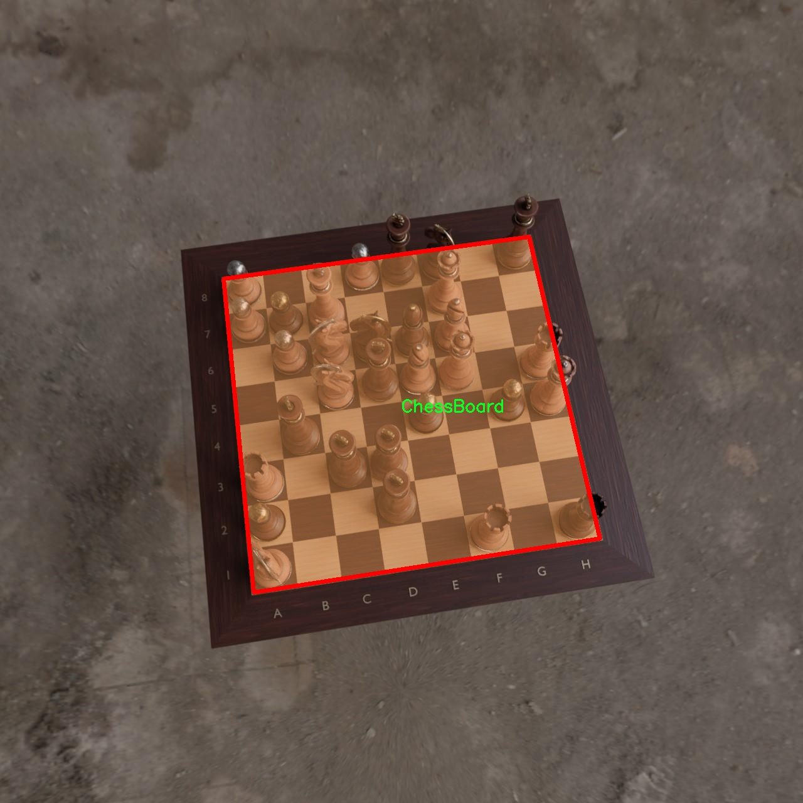
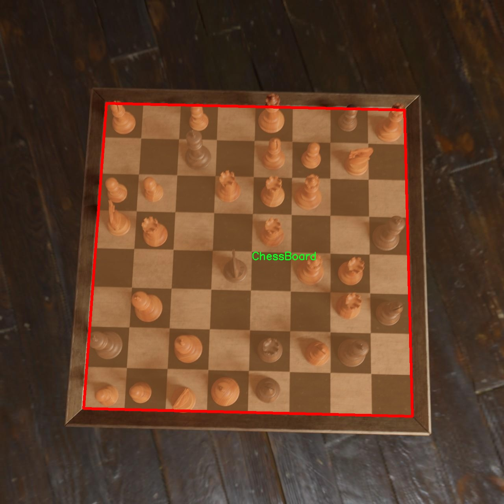
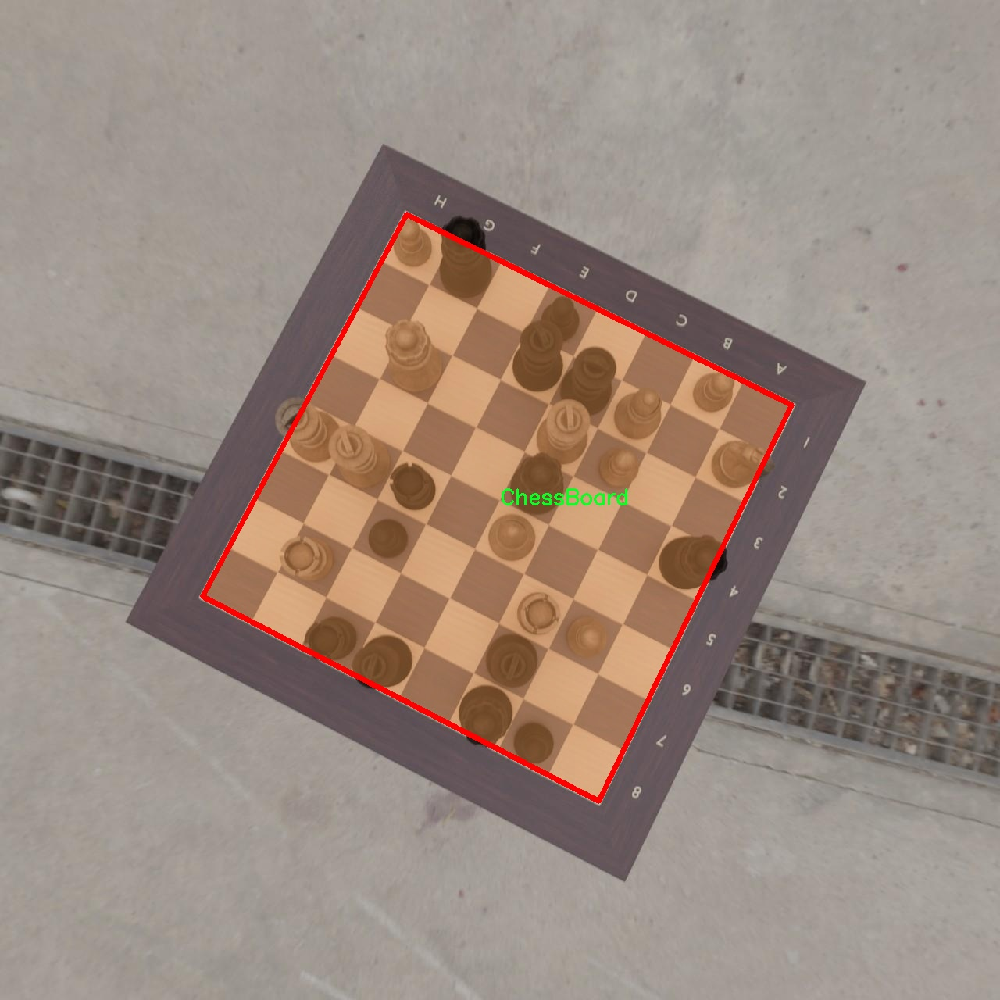
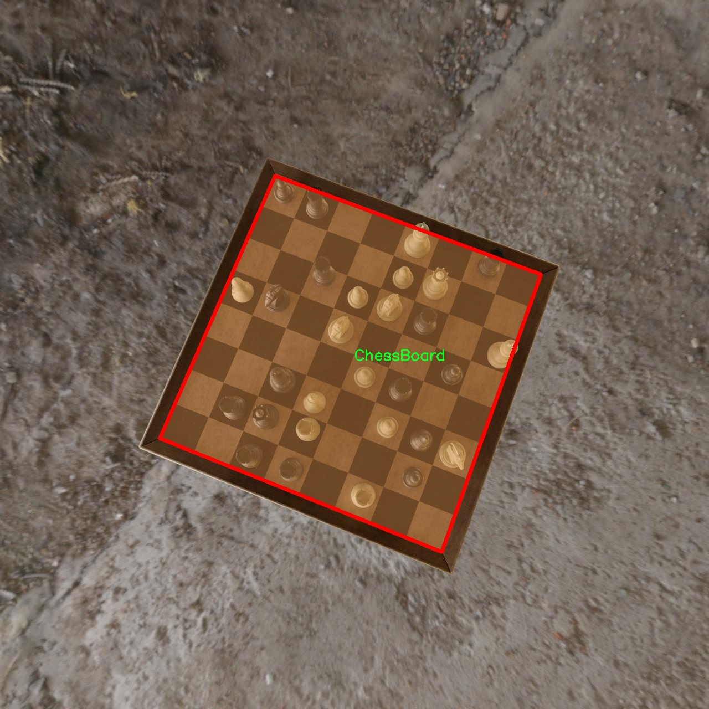
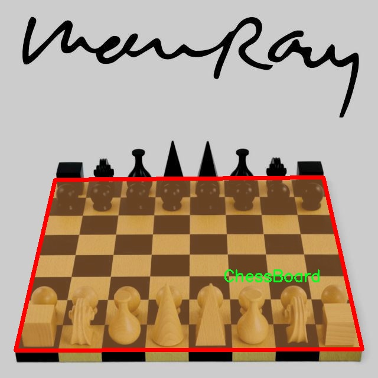

# 棋盘图像分割系统： yolov8-seg-RCSOSA

### 1.研究背景与意义

[参考博客](https://gitee.com/YOLOv8_YOLOv11_Segmentation_Studio/projects)

[博客来源](https://kdocs.cn/l/cszuIiCKVNis)

研究背景与意义

随着计算机视觉技术的迅猛发展，图像分割作为其中一个重要的研究方向，受到了广泛的关注。图像分割的目标是将图像分割成多个有意义的区域，以便于后续的分析和处理。在众多的图像分割任务中，棋盘图像的分割具有重要的应用价值，尤其是在智能游戏、自动化检测和机器人视觉等领域。棋盘图像不仅在棋类游戏中扮演着核心角色，同时也在图像处理、模式识别等领域中被广泛应用。因此，针对棋盘图像的高效分割方法的研究显得尤为重要。

近年来，YOLO（You Only Look Once）系列模型因其高效的实时检测能力而受到广泛关注。YOLOv8作为该系列的最新版本，结合了深度学习的最新进展，具备了更强的特征提取能力和更快的处理速度。然而，尽管YOLOv8在目标检测方面表现优异，但在细粒度的图像分割任务中仍然存在一定的局限性。尤其是在处理复杂背景或光照变化较大的棋盘图像时，传统的YOLOv8模型可能无法充分捕捉到棋盘的细节特征。因此，基于YOLOv8的改进，构建一个专门针对棋盘图像的分割系统，将是提升棋盘图像处理精度的有效途径。

本研究将围绕“基于改进YOLOv8的棋盘图像分割系统”展开，使用的主要数据集为“ChessBoardSegmentation”，该数据集包含3400张棋盘图像，类别数量为1，专注于棋盘的实例分割。通过对这一数据集的深入分析与处理，能够为模型的训练提供丰富的样本支持，从而提高模型的泛化能力和鲁棒性。此外，数据集的单一类别特性使得研究者能够集中精力优化棋盘图像的分割效果，避免了多类别干扰带来的复杂性。

本研究的意义不仅在于提升棋盘图像的分割精度，更在于推动图像分割技术在特定领域的应用发展。通过改进YOLOv8模型，使其更适应棋盘图像的特征，能够为智能棋类游戏的开发提供技术支持，同时也为其他需要精确图像分割的应用场景提供借鉴。进一步地，研究成果有望推动计算机视觉领域的前沿发展，促进相关技术在实际应用中的落地与推广。

综上所述，基于改进YOLOv8的棋盘图像分割系统的研究，不仅具有重要的理论价值，还具有广泛的应用前景。通过对棋盘图像的精确分割，可以为后续的智能分析、决策支持等提供基础数据，推动智能化时代的到来。因此，本研究将为计算机视觉领域的进一步探索提供新的思路和方法，具有重要的学术意义和应用价值。

### 2.图片演示







注意：本项目提供完整的训练源码数据集和训练教程,由于此博客编辑较早,暂不提供权重文件（best.pt）,需要按照6.训练教程进行训练后实现上图效果。

### 3.视频演示

[3.1 视频演示](https://www.bilibili.com/video/BV11pB1YuEGa/)

### 4.数据集信息

##### 4.1 数据集类别数＆类别名

nc: 1
names: ['ChessBoard']


##### 4.2 数据集信息简介

数据集信息展示

在计算机视觉领域，图像分割技术的进步为许多应用场景提供了强有力的支持，尤其是在目标检测和图像理解方面。为此，本研究采用了名为“ChessBoardSegmentation”的数据集，旨在训练和改进YOLOv8-seg模型，以实现高效的棋盘图像分割。该数据集专注于棋盘图像的精确分割，具有独特的结构和特征，使其成为训练深度学习模型的理想选择。

“ChessBoardSegmentation”数据集包含了丰富的棋盘图像，所有图像均经过精心挑选和标注，以确保数据的质量和多样性。该数据集的类别数量为1，具体类别为“ChessBoard”。这一设计使得模型能够专注于棋盘这一特定目标，减少了背景干扰，提高了分割精度。棋盘作为一种具有高度规则性的图案，其特征在于黑白交替的方格结构，这为图像分割任务提供了良好的基础。

在数据集的构建过程中，考虑到了多种不同的棋盘图像场景，包括不同的光照条件、角度和背景。这样的多样性不仅增强了模型的鲁棒性，还提高了其在实际应用中的适应能力。数据集中包含的图像数量和分辨率也经过精心设计，以确保模型在训练过程中能够获得足够的信息，从而有效地学习棋盘的特征。

此外，数据集的标注工作采用了先进的标注工具，确保每一幅图像中的棋盘区域都被准确地框定。这种精确的标注为模型提供了清晰的学习目标，使得YOLOv8-seg能够在训练过程中更好地理解棋盘的形状和结构。通过对这些标注数据的分析，模型可以学习到棋盘的边缘、角落以及不同光照下的表现，从而在分割任务中实现更高的准确率。

在训练过程中，模型将通过反复迭代的方式，不断优化其参数，以提高分割的精度和速度。数据集的设计理念也强调了模型的可扩展性，未来可以根据需要添加更多的棋盘图像，或者引入其他相关类别，以进一步提升模型的性能。这样的灵活性使得“ChessBoardSegmentation”数据集不仅适用于当前的研究目标，也为后续的相关研究提供了广阔的空间。

总之，“ChessBoardSegmentation”数据集在棋盘图像分割的研究中扮演了至关重要的角色。通过对这一数据集的深入分析和应用，研究人员能够更好地理解棋盘图像的特征，从而推动YOLOv8-seg模型的改进与发展。随着数据集的不断丰富和模型的不断优化，棋盘图像分割技术的应用前景将更加广阔，为相关领域的研究和实践提供强有力的支持。











### 5.项目依赖环境部署教程（零基础手把手教学）

[5.1 环境部署教程链接（零基础手把手教学）](https://www.bilibili.com/video/BV1jG4Ve4E9t/?vd_source=bc9aec86d164b67a7004b996143742dc)


[5.2 安装Python虚拟环境创建和依赖库安装视频教程链接（零基础手把手教学）](https://www.bilibili.com/video/BV1nA4VeYEze/?vd_source=bc9aec86d164b67a7004b996143742dc)

### 6.手把手YOLOV8-seg训练视频教程（零基础手把手教学）

[6.1 手把手YOLOV8-seg训练视频教程（零基础小白有手就能学会）](https://www.bilibili.com/video/BV1cA4VeYETe/?vd_source=bc9aec86d164b67a7004b996143742dc)


按照上面的训练视频教程链接加载项目提供的数据集，运行train.py即可开始训练



     Epoch   gpu_mem       box       obj       cls    labels  img_size
     1/200     0G   0.01576   0.01955  0.007536        22      1280: 100%|██████████| 849/849 [14:42<00:00,  1.04s/it]
               Class     Images     Labels          P          R     mAP@.5 mAP@.5:.95: 100%|██████████| 213/213 [01:14<00:00,  2.87it/s]
                 all       3395      17314      0.994      0.957      0.0957      0.0843

     Epoch   gpu_mem       box       obj       cls    labels  img_size
     2/200     0G   0.01578   0.01923  0.007006        22      1280: 100%|██████████| 849/849 [14:44<00:00,  1.04s/it]
               Class     Images     Labels          P          R     mAP@.5 mAP@.5:.95: 100%|██████████| 213/213 [01:12<00:00,  2.95it/s]
                 all       3395      17314      0.996      0.956      0.0957      0.0845

     Epoch   gpu_mem       box       obj       cls    labels  img_size
     3/200     0G   0.01561    0.0191  0.006895        27      1280: 100%|██████████| 849/849 [10:56<00:00,  1.29it/s]
               Class     Images     Labels          P          R     mAP@.5 mAP@.5:.95: 100%|███████   | 187/213 [00:52<00:00,  4.04it/s]
                 all       3395      17314      0.996      0.957      0.0957      0.0845


### 7.50+种全套YOLOV8-seg创新点加载调参实验视频教程（一键加载写好的改进模型的配置文件）

[7.1 50+种全套YOLOV8-seg创新点加载调参实验视频教程（一键加载写好的改进模型的配置文件）](https://www.bilibili.com/video/BV1Hw4VePEXv/?vd_source=bc9aec86d164b67a7004b996143742dc)

### YOLOV8-seg算法简介

原始YOLOv8-seg算法原理

YOLOv8-seg算法是YOLO系列目标检测模型的最新进展，结合了目标检测与图像分割的任务，旨在提供更高效且精确的图像理解能力。该算法的设计理念基于YOLOv5的架构，并在此基础上进行了深度优化与升级，形成了一个包含多个版本的灵活框架，其中轻量化的YOLOv8n模型尤为突出。YOLOv8-seg不仅仅是对目标检测的简单扩展，它通过引入先进的特征提取和融合机制，极大地提升了模型在复杂场景下的表现。

在YOLOv8-seg的架构中，整体网络结构主要由输入层、主干网络、颈部网络和检测头组成。输入层负责对输入图像进行预处理，包括缩放、增强等操作，以适应模型的输入要求。主干网络采用了轻量化的C2F模块，替代了传统的C3模块，利用3×3的卷积核和深度可分离卷积的设计，显著降低了计算复杂度，同时保持了特征提取的有效性。C2F模块的引入，使得模型在提取特征时能够实现更丰富的梯度流动，进而改善检测和分割的精度。

在特征提取过程中，YOLOv8-seg通过SPPF模块（Spatial Pyramid Pooling Fast）对多尺度特征进行处理，利用不同尺寸的池化层来增强特征图的抽象能力。这一过程确保了模型能够在多种尺度下捕捉到重要的特征信息，为后续的特征融合奠定了基础。颈部网络则采用了特征金字塔网络（FPN）与路径聚合网络（PAN）的结合，进一步优化了不同尺度特征的融合过程。FPN负责从不同层次提取语义信息，而PAN则增强了特征的传递效率，确保了高层语义信息与低层定位信息的有效结合。

YOLOv8-seg的检测头采用了解耦结构，分别处理回归和分类任务。这种设计的优势在于能够加速模型的收敛速度，并提高最终的检测精度。解耦头的引入使得模型在进行目标检测的同时，能够有效地进行实例分割，提升了对复杂场景的理解能力。在实际应用中，YOLOv8-seg能够同时输出目标的边界框和分割掩码，为后续的图像分析提供了丰富的信息。

值得注意的是，YOLOv8-seg在处理不同尺度目标时表现尤为出色。通过BiFPN（Bidirectional Feature Pyramid Network）的引入，模型实现了高效的双向跨尺度连接，增强了特征的加权融合能力。这一机制不仅提高了特征提取的速度，还使得模型在面对多样化的目标时，能够更好地适应不同的特征尺度，从而提升了检测和分割的整体性能。

在训练过程中，YOLOv8-seg利用了多种数据增强技术，如Mosaic增强和混合精度训练，进一步提升了模型的鲁棒性和泛化能力。Mosaic增强通过将多张图像拼接在一起，生成新的训练样本，丰富了模型的训练数据，增强了其对复杂背景和多目标场景的适应能力。此外，YOLOv8-seg还采用了改进的损失函数，以更好地平衡分类与回归任务之间的关系，确保模型在不同任务上的表现均衡。

综上所述，YOLOv8-seg算法通过一系列创新的设计和优化，不仅提升了目标检测的精度和速度，还在图像分割任务中展现了强大的能力。其轻量化的结构和高效的特征融合机制，使得YOLOv8-seg在实际应用中具备了广泛的适用性，能够满足多种复杂场景下的需求。随着YOLOv8-seg的不断发展与完善，未来在智能监控、自动驾驶、医疗影像分析等领域的应用前景将更加广阔。


### 9.系统功能展示（检测对象为举例，实际内容以本项目数据集为准）

图9.1.系统支持检测结果表格显示

  图9.2.系统支持置信度和IOU阈值手动调节

  图9.3.系统支持自定义加载权重文件best.pt(需要你通过步骤5中训练获得)

  图9.4.系统支持摄像头实时识别

  图9.5.系统支持图片识别

  图9.6.系统支持视频识别

  图9.7.系统支持识别结果文件自动保存

  图9.8.系统支持Excel导出检测结果数据


### 10.50+种全套YOLOV8-seg创新点原理讲解（非科班也可以轻松写刊发刊，V11版本正在科研待更新）

#### 10.1 由于篇幅限制，每个创新点的具体原理讲解就不一一展开，具体见下列网址中的创新点对应子项目的技术原理博客网址【Blog】：


[10.1 50+种全套YOLOV8-seg创新点原理讲解链接](https://gitee.com/qunmasj/good)

#### 10.2 部分改进模块原理讲解(完整的改进原理见上图和技术博客链接)【如果此小节的图加载失败可以通过CSDN或者Github搜索该博客的标题访问原始博客，原始博客图片显示正常】

### Gold-YOLO


#### Preliminaries
YOLO系列的中间层结构采用了传统的FPN结构，其中包含多个分支用于多尺度特征融合。然而，它只充分融合来自相邻级别的特征，对于其他层次的信息只能间接地进行“递归”获取。

传统的FPN结构在信息传输过程中存在丢失大量信息的问题。这是因为层之间的信息交互仅限于中间层选择的信息，未被选择的信息在传输过程中被丢弃。这种情况导致某个Level的信息只能充分辅助相邻层，而对其他全局层的帮助较弱。因此，整体上信息融合的有效性可能受到限制。
为了避免在传输过程中丢失信息，本文采用了一种新颖的“聚集和分发”机制（GD），放弃了原始的递归方法。该机制使用一个统一的模块来收集和融合所有Level的信息，并将其分发到不同的Level。通过这种方式，作者不仅避免了传统FPN结构固有的信息丢失问题，还增强了中间层的部分信息融合能力，而且并没有显著增加延迟。


#### 低阶聚合和分发分支 Low-stage gather-and-distribute branch
从主干网络中选择输出的B2、B3、B4、B5特征进行融合，以获取保留小目标信息的高分辨率特征。


#### 高阶聚合和分发分支 High-stage gather-and-distribute branch
高级全局特征对齐模块（High-GD）将由低级全局特征对齐模块（Low-GD）生成的特征{P3, P4, P5}进行融合。


Transformer融合模块由多个堆叠的transformer组成，transformer块的数量为L。每个transformer块包括一个多头注意力块、一个前馈网络（FFN）和残差连接。采用与LeViT相同的设置来配置多头注意力块，使用16个通道作为键K和查询Q的头维度，32个通道作为值V的头维度。为了加速推理过程，将层归一化操作替换为批归一化，并将所有的GELU激活函数替换为ReLU。为了增强变换器块的局部连接，在两个1x1卷积层之间添加了一个深度卷积层。同时，将FFN的扩展因子设置为2，以在速度和计算成本之间取得平衡。


信息注入模块(Information injection module)： 高级全局特征对齐模块（High-GD）中的信息注入模块与低级全局特征对齐模块（Low-GD）中的相同。在高级阶段，局部特征（Flocal）等于Pi，因此公式如下所示：


#### 增强的跨层信息流动 Enhanced cross-layer information flow
为了进一步提升性能，从YOLOv6 中的PAFPN模块中得到启发，引入了Inject-LAF模块。该模块是注入模块的增强版，包括了一个轻量级相邻层融合（LAF）模块，该模块被添加到注入模块的输入位置。为了在速度和准确性之间取得平衡，设计了两个LAF模型：LAF低级模型和LAF高级模型，分别用于低级注入（合并相邻两层的特征）和高级注入（合并相邻一层的特征）。它们的结构如图5(b)所示。为了确保来自不同层级的特征图与目标大小对齐，在实现中的两个LAF模型仅使用了三个操作符：双线性插值（上采样过小的特征）、平均池化（下采样过大的特征）和1x1卷积（调整与目标通道不同的特征）。模型中的LAF模块与信息注入模块的结合有效地平衡了准确性和速度之间的关系。通过使用简化的操作，能够增加不同层级之间的信息流路径数量，从而提高性能而不显著增加延迟。


### 11.项目核心源码讲解（再也不用担心看不懂代码逻辑）

#### 11.1 ultralytics\data\dataset.py

以下是对代码中最核心部分的提炼和详细中文注释：

```python
import contextlib
from itertools import repeat
from multiprocessing.pool import ThreadPool
from pathlib import Path
import cv2
import numpy as np
import torch
import torchvision
from ultralytics.utils import LOCAL_RANK, NUM_THREADS, TQDM, colorstr, is_dir_writeable
from .base import BaseDataset
from .utils import HELP_URL, LOGGER, get_hash, img2label_paths, verify_image, verify_image_label

# Ultralytics 数据集缓存版本，>= 1.0.0 用于 YOLOv8
DATASET_CACHE_VERSION = '1.0.3'

class YOLODataset(BaseDataset):
    """
    YOLO 数据集类，用于加载 YOLO 格式的目标检测和/或分割标签。

    参数:
        data (dict, optional): 数据集 YAML 字典。默认为 None。
        use_segments (bool, optional): 如果为 True，则使用分割掩码作为标签。默认为 False。
        use_keypoints (bool, optional): 如果为 True，则使用关键点作为标签。默认为 False。

    返回:
        (torch.utils.data.Dataset): 可用于训练目标检测模型的 PyTorch 数据集对象。
    """

    def __init__(self, *args, data=None, use_segments=False, use_keypoints=False, **kwargs):
        """初始化 YOLODataset，支持分割和关键点的可选配置。"""
        self.use_segments = use_segments
        self.use_keypoints = use_keypoints
        self.data = data
        assert not (self.use_segments and self.use_keypoints), '不能同时使用分割和关键点。'
        super().__init__(*args, **kwargs)

    def cache_labels(self, path=Path('./labels.cache')):
        """
        缓存数据集标签，检查图像并读取形状。

        参数:
            path (Path): 保存缓存文件的路径（默认: Path('./labels.cache')）。
        返回:
            (dict): 标签字典。
        """
        x = {'labels': []}
        nm, nf, ne, nc, msgs = 0, 0, 0, 0, []  # 缺失、找到、空、损坏的数量及消息
        desc = f'{self.prefix}扫描 {path.parent / path.stem}...'
        total = len(self.im_files)
        nkpt, ndim = self.data.get('kpt_shape', (0, 0))
        
        # 检查关键点形状是否正确
        if self.use_keypoints and (nkpt <= 0 or ndim not in (2, 3)):
            raise ValueError("'kpt_shape' 在 data.yaml 中缺失或不正确。应为 [关键点数量, 维度] 的列表，例如 'kpt_shape: [17, 3]'")
        
        # 使用线程池并行处理图像验证
        with ThreadPool(NUM_THREADS) as pool:
            results = pool.imap(func=verify_image_label,
                                iterable=zip(self.im_files, self.label_files, repeat(self.prefix),
                                             repeat(self.use_keypoints), repeat(len(self.data['names'])), repeat(nkpt),
                                             repeat(ndim)))
            pbar = TQDM(results, desc=desc, total=total)
            for im_file, lb, shape, segments, keypoint, nm_f, nf_f, ne_f, nc_f, msg in pbar:
                nm += nm_f
                nf += nf_f
                ne += ne_f
                nc += nc_f
                if im_file:
                    x['labels'].append(
                        dict(
                            im_file=im_file,
                            shape=shape,
                            cls=lb[:, 0:1],  # 类别，形状为 (n, 1)
                            bboxes=lb[:, 1:],  # 边界框，形状为 (n, 4)
                            segments=segments,
                            keypoints=keypoint,
                            normalized=True,
                            bbox_format='xywh'))  # 边界框格式为 xywh
                if msg:
                    msgs.append(msg)
                pbar.desc = f'{desc} {nf} 张图像, {nm + ne} 背景, {nc} 损坏'
            pbar.close()

        if msgs:
            LOGGER.info('\n'.join(msgs))
        if nf == 0:
            LOGGER.warning(f'{self.prefix}警告 ⚠️ 在 {path} 中未找到标签。{HELP_URL}')
        
        # 生成数据集哈希并保存缓存
        x['hash'] = get_hash(self.label_files + self.im_files)
        x['results'] = nf, nm, ne, nc, len(self.im_files)
        x['msgs'] = msgs  # 警告信息
        save_dataset_cache_file(self.prefix, path, x)
        return x

    def get_labels(self):
        """返回 YOLO 训练的标签字典。"""
        self.label_files = img2label_paths(self.im_files)  # 获取标签文件路径
        cache_path = Path(self.label_files[0]).parent.with_suffix('.cache')  # 缓存文件路径
        
        # 尝试加载缓存文件
        try:
            cache, exists = load_dataset_cache_file(cache_path), True  # 尝试加载 *.cache 文件
            assert cache['version'] == DATASET_CACHE_VERSION  # 检查版本
            assert cache['hash'] == get_hash(self.label_files + self.im_files)  # 检查哈希
        except (FileNotFoundError, AssertionError, AttributeError):
            cache, exists = self.cache_labels(cache_path), False  # 运行缓存操作

        # 显示缓存结果
        nf, nm, ne, nc, n = cache.pop('results')  # 找到、缺失、空、损坏、总数
        if exists and LOCAL_RANK in (-1, 0):
            d = f'扫描 {cache_path}... {nf} 张图像, {nm + ne} 背景, {nc} 损坏'
            TQDM(None, desc=self.prefix + d, total=n, initial=n)  # 显示结果
            if cache['msgs']:
                LOGGER.info('\n'.join(cache['msgs']))  # 显示警告

        # 读取缓存
        [cache.pop(k) for k in ('hash', 'version', 'msgs')]  # 移除不需要的项
        labels = cache['labels']
        if not labels:
            LOGGER.warning(f'警告 ⚠️ 在 {cache_path} 中未找到图像，训练可能无法正常工作。{HELP_URL}')
        self.im_files = [lb['im_file'] for lb in labels]  # 更新图像文件列表

        # 检查数据集是否全为边界框或全为分割
        lengths = ((len(lb['cls']), len(lb['bboxes']), len(lb['segments'])) for lb in labels)
        len_cls, len_boxes, len_segments = (sum(x) for x in zip(*lengths))
        if len_segments and len_boxes != len_segments:
            LOGGER.warning(
                f'警告 ⚠️ 边界框和分割计数应相等，但 len(segments) = {len_segments}, len(boxes) = {len_boxes}。'
                '为了解决此问题，将仅使用边界框并删除所有分割。请提供检测或分割数据集，而不是混合数据集。')
            for lb in labels:
                lb['segments'] = []  # 清空分割
        if len_cls == 0:
            LOGGER.warning(f'警告 ⚠️ 在 {cache_path} 中未找到标签，训练可能无法正常工作。{HELP_URL}')
        return labels

    def build_transforms(self, hyp=None):
        """构建并附加变换到列表中。"""
        if self.augment:
            hyp.mosaic = hyp.mosaic if self.augment and not self.rect else 0.0
            hyp.mixup = hyp.mixup if self.augment and not self.rect else 0.0
            transforms = v8_transforms(self, self.imgsz, hyp)  # 使用 YOLOv8 变换
        else:
            transforms = Compose([LetterBox(new_shape=(self.imgsz, self.imgsz), scaleup=False)])  # 使用字母框变换
        transforms.append(
            Format(bbox_format='xywh',
                   normalize=True,
                   return_mask=self.use_segments,
                   return_keypoint=self.use_keypoints,
                   batch_idx=True,
                   mask_ratio=hyp.mask_ratio,
                   mask_overlap=hyp.overlap_mask))  # 格式化变换
        return transforms

    @staticmethod
    def collate_fn(batch):
        """将数据样本聚合成批次。"""
        new_batch = {}
        keys = batch[0].keys()
        values = list(zip(*[list(b.values()) for b in batch]))
        for i, k in enumerate(keys):
            value = values[i]
            if k == 'img':
                value = torch.stack(value, 0)  # 堆叠图像
            if k in ['masks', 'keypoints', 'bboxes', 'cls']:
                value = torch.cat(value, 0)  # 连接掩码、关键点、边界框和类别
            new_batch[k] = value
        new_batch['batch_idx'] = list(new_batch['batch_idx'])
        for i in range(len(new_batch['batch_idx'])):
            new_batch['batch_idx'][i] += i  # 为 build_targets() 添加目标图像索引
        new_batch['batch_idx'] = torch.cat(new_batch['batch_idx'], 0)  # 连接批次索引
        return new_batch
```

### 核心部分说明：
1. **YOLODataset 类**：负责加载 YOLO 格式的数据集，处理标签、图像验证、缓存等功能。
2. **cache_labels 方法**：缓存标签并验证图像的有效性，返回标签字典。
3. **get_labels 方法**：获取标签，尝试加载缓存文件，如果失败则调用 `cache_labels` 方法。
4. **build_transforms 方法**：构建数据增强的变换，返回变换列表。
5. **collate_fn 方法**：将多个样本聚合成一个批次，适用于数据加载器。

以上是对代码的核心部分和功能的详细中文注释。

该文件是Ultralytics YOLO（You Only Look Once）框架的一部分，主要用于处理数据集的加载和管理。文件中定义了几个类，主要包括YOLODataset、ClassificationDataset和SemanticDataset，以及一些辅助函数。

首先，YOLODataset类是用于加载YOLO格式的目标检测和分割标签的数据集。该类的构造函数接受多个参数，包括数据集的配置（以字典形式传入），是否使用分割掩码和关键点等。构造函数中会进行一些基本的参数检查，确保不能同时使用分割和关键点。

YOLODataset类中有几个重要的方法。cache_labels方法用于缓存数据集标签，检查图像的有效性并读取其形状。它会遍历图像文件和标签文件，利用多线程来提高效率，并在处理过程中收集一些统计信息，如找到的图像数量、缺失的图像数量等。get_labels方法则用于获取YOLO训练所需的标签字典，首先尝试加载缓存文件，如果缓存文件不存在或不匹配，则调用cache_labels方法生成新的缓存。

build_transforms方法用于构建数据增强的转换操作，如果启用了增强，则会根据超参数生成不同的转换操作。close_mosaic方法则是将一些增强选项设置为0，并重新构建转换操作。update_labels_info方法用于自定义标签格式，主要是将标签中的边界框、分割和关键点信息封装到一个实例对象中。collate_fn方法用于将数据样本合并成批次，以便于模型训练。

接下来是ClassificationDataset类，它是YOLO分类数据集的实现，继承自torchvision的ImageFolder类。该类的构造函数接受数据集路径、参数设置、增强选项和缓存设置。__getitem__方法用于根据索引返回数据和目标，支持从内存或磁盘加载图像，并应用相应的转换。verify_images方法用于验证数据集中所有图像的有效性，确保数据集的完整性。

文件中还定义了load_dataset_cache_file和save_dataset_cache_file两个辅助函数，用于加载和保存数据集的缓存文件。最后，SemanticDataset类是一个占位符类，未来可能会添加用于语义分割任务的方法和属性。

整体而言，该文件的主要功能是为YOLO模型提供灵活的数据集管理和加载机制，支持多种数据增强和缓存策略，以提高训练效率和模型性能。

#### 11.2 ultralytics\models\rtdetr\__init__.py

以下是代码中最核心的部分，并附上详细的中文注释：

```python
# 导入必要的模块和类
from .model import RTDETR  # 从当前包的model模块中导入RTDETR类
from .predict import RTDETRPredictor  # 从当前包的predict模块中导入RTDETRPredictor类
from .val import RTDETRValidator  # 从当前包的val模块中导入RTDETRValidator类

# 定义模块的公开接口
__all__ = 'RTDETRPredictor', 'RTDETRValidator', 'RTDETR'  # 指定在使用from <module> import *时，公开的类
```

### 代码注释说明：
1. **导入模块**：
   - `from .model import RTDETR`：这行代码从当前包的`model`模块中导入了`RTDETR`类，`RTDETR`可能是一个用于目标检测的模型。
   - `from .predict import RTDETRPredictor`：这行代码从当前包的`predict`模块中导入了`RTDETRPredictor`类，`RTDETRPredictor`可能用于对输入数据进行预测。
   - `from .val import RTDETRValidator`：这行代码从当前包的`val`模块中导入了`RTDETRValidator`类，`RTDETRValidator`可能用于验证模型的性能。

2. **定义公开接口**：
   - `__all__`是一个特殊变量，用于定义当使用`from <module> import *`时，哪些名称是可以被导入的。在这里，只有`RTDETRPredictor`、`RTDETRValidator`和`RTDETR`这三个类会被公开，其他模块中的内容将不会被导入。这有助于控制模块的公共API，避免不必要的命名冲突。

这个程序文件是一个Python模块的初始化文件，位于`ultralytics\models\rtdetr`目录下。文件的开头包含了一条注释，表明这个项目是Ultralytics YOLO的一部分，并且遵循AGPL-3.0许可证。

在文件中，首先从当前模块（即`ultralytics.models.rtdetr`）中导入了三个类：`RTDETR`、`RTDETRPredictor`和`RTDETRValidator`。这些类可能分别代表一个模型、一个预测器和一个验证器，具体功能取决于它们的实现。

最后，`__all__`变量被定义为一个包含字符串的元组，列出了该模块公开的接口。这意味着当使用`from ultralytics.models.rtdetr import *`语句时，只会导入`RTDETRPredictor`、`RTDETRValidator`和`RTDETR`这三个类。这种做法有助于控制模块的公共接口，避免不必要的内部实现被外部访问。

总体而言，这个文件的主要作用是组织和导出与RTDETR相关的功能，使得其他模块或脚本可以方便地使用这些功能。

#### 11.3 ultralytics\models\fastsam\model.py

```python
# 导入所需的库
from pathlib import Path
from ultralytics.engine.model import Model
from .predict import FastSAMPredictor
from .val import FastSAMValidator

class FastSAM(Model):
    """
    FastSAM模型接口。

    示例用法：
        ```python
        from ultralytics import FastSAM

        model = FastSAM('last.pt')  # 加载模型
        results = model.predict('ultralytics/assets/bus.jpg')  # 进行预测
        ```
    """

    def __init__(self, model='FastSAM-x.pt'):
        """初始化FastSAM类，调用父类（YOLO）的__init__方法，并设置默认模型。"""
        # 如果传入的模型名称是'FastSAM.pt'，则将其替换为'FastSAM-x.pt'
        if str(model) == 'FastSAM.pt':
            model = 'FastSAM-x.pt'
        # 确保传入的模型文件后缀不是.yaml或.yml，FastSAM模型只支持预训练模型
        assert Path(model).suffix not in ('.yaml', '.yml'), 'FastSAM models only support pre-trained models.'
        # 调用父类的初始化方法，设置模型和任务类型为'segment'
        super().__init__(model=model, task='segment')

    @property
    def task_map(self):
        """返回一个字典，将分割任务映射到相应的预测器和验证器类。"""
        return {'segment': {'predictor': FastSAMPredictor, 'validator': FastSAMValidator}}
```

### 代码核心部分及注释说明：
1. **导入模块**：导入了必要的模块和类，包括路径处理和模型基类。
2. **FastSAM类**：继承自`Model`类，表示FastSAM模型的接口。
3. **初始化方法**：
   - 处理模型名称，确保使用正确的模型文件。
   - 检查模型文件后缀，确保只使用预训练模型。
   - 调用父类的初始化方法，设置模型和任务类型。
4. **任务映射属性**：定义了一个属性`task_map`，返回一个字典，映射分割任务到相应的预测器和验证器类。

这个程序文件定义了一个名为 `FastSAM` 的类，它是 Ultralytics YOLO 模型的一部分，主要用于图像分割任务。首先，文件导入了一些必要的模块，包括 `Path` 用于处理文件路径，以及从 `ultralytics.engine.model` 导入的 `Model` 类，后者是 FastSAM 类的父类。此外，还导入了 `FastSAMPredictor` 和 `FastSAMValidator`，这两个类分别用于预测和验证。

在 `FastSAM` 类的文档字符串中，提供了一个简单的使用示例，展示了如何实例化模型并进行预测。用户可以通过传入模型文件的路径来创建 `FastSAM` 对象，并使用 `predict` 方法对图像进行处理。

类的构造函数 `__init__` 接受一个模型参数，默认值为 `'FastSAM-x.pt'`。在构造函数中，如果传入的模型名称是 `'FastSAM.pt'`，则将其更改为 `'FastSAM-x.pt'`。接着，代码通过断言确保传入的模型文件后缀不是 `.yaml` 或 `.yml`，因为 FastSAM 模型只支持预训练模型。最后，调用父类的构造函数，传入模型路径和任务类型（这里是 'segment'，表示分割任务）。

类中还有一个名为 `task_map` 的属性，它返回一个字典，映射了分割任务到相应的预测器和验证器类。这使得在执行分割任务时，可以方便地获取对应的处理类，增强了代码的可扩展性和可维护性。整体来看，这个文件为 FastSAM 模型的使用提供了一个清晰的接口和基础结构。

#### 11.4 ultralytics\utils\callbacks\clearml.py

以下是代码中最核心的部分，并附上详细的中文注释：

```python
# 导入必要的库
from ultralytics.utils import LOGGER, SETTINGS, TESTS_RUNNING

# 尝试导入 ClearML 相关的库，并进行一些基本的检查
try:
    assert not TESTS_RUNNING  # 确保不是在测试环境中
    assert SETTINGS['clearml'] is True  # 确保 ClearML 集成已启用
    import clearml
    from clearml import Task
    from clearml.binding.frameworks.pytorch_bind import PatchPyTorchModelIO
    from clearml.binding.matplotlib_bind import PatchedMatplotlib

    assert hasattr(clearml, '__version__')  # 确保 ClearML 包是有效的

except (ImportError, AssertionError):
    clearml = None  # 如果导入失败，设置 clearml 为 None


def on_pretrain_routine_start(trainer):
    """在预训练例程开始时运行；初始化并连接/记录任务到 ClearML。"""
    try:
        task = Task.current_task()  # 获取当前任务
        if task:
            # 确保自动的 PyTorch 和 Matplotlib 绑定被禁用
            PatchPyTorchModelIO.update_current_task(None)
            PatchedMatplotlib.update_current_task(None)
        else:
            # 初始化一个新的 ClearML 任务
            task = Task.init(project_name=trainer.args.project or 'YOLOv8',
                             task_name=trainer.args.name,
                             tags=['YOLOv8'],
                             output_uri=True,
                             reuse_last_task_id=False,
                             auto_connect_frameworks={
                                 'pytorch': False,
                                 'matplotlib': False})
            LOGGER.warning('ClearML 初始化了一个新任务。如果您想远程运行，请在初始化 YOLO 之前添加 clearml-init 并连接您的参数。')
        task.connect(vars(trainer.args), name='General')  # 连接训练参数
    except Exception as e:
        LOGGER.warning(f'警告 ⚠️ ClearML 已安装但未正确初始化，未记录此运行。{e}')


def on_train_epoch_end(trainer):
    """在 YOLO 训练的每个 epoch 结束时记录调试样本并报告当前训练进度。"""
    task = Task.current_task()  # 获取当前任务
    if task:
        # 记录调试样本
        if trainer.epoch == 1:
            _log_debug_samples(sorted(trainer.save_dir.glob('train_batch*.jpg')), 'Mosaic')
        # 报告当前训练进度
        for k, v in trainer.validator.metrics.results_dict.items():
            task.get_logger().report_scalar('train', k, v, iteration=trainer.epoch)


def on_train_end(trainer):
    """在训练完成时记录最终模型及其名称。"""
    task = Task.current_task()  # 获取当前任务
    if task:
        # 记录最终结果，包括混淆矩阵和 PR 曲线
        files = [
            'results.png', 'confusion_matrix.png', 'confusion_matrix_normalized.png',
            *(f'{x}_curve.png' for x in ('F1', 'PR', 'P', 'R'))]
        files = [(trainer.save_dir / f) for f in files if (trainer.save_dir / f).exists()]  # 过滤存在的文件
        for f in files:
            _log_plot(title=f.stem, plot_path=f)  # 记录图像
        # 报告最终指标
        for k, v in trainer.validator.metrics.results_dict.items():
            task.get_logger().report_single_value(k, v)
        # 记录最终模型
        task.update_output_model(model_path=str(trainer.best), model_name=trainer.args.name, auto_delete_file=False)


# 定义回调函数
callbacks = {
    'on_pretrain_routine_start': on_pretrain_routine_start,
    'on_train_epoch_end': on_train_epoch_end,
    'on_train_end': on_train_end} if clearml else {}
```

### 代码核心部分说明：
1. **ClearML 初始化**：在代码开始部分，尝试导入 ClearML 库并进行基本的检查，以确保环境设置正确。如果导入失败，`clearml` 将被设置为 `None`，后续的代码将不会执行 ClearML 相关的操作。

2. **任务初始化**：在 `on_pretrain_routine_start` 函数中，初始化一个新的 ClearML 任务，并连接训练参数。这是记录训练过程的关键步骤。

3. **训练过程记录**：在 `on_train_epoch_end` 和 `on_train_end` 函数中，记录训练过程中的调试样本、训练进度和最终模型。这些信息将被上传到 ClearML 服务器，以便后续分析和可视化。

4. **回调函数**：定义了一个 `callbacks` 字典，包含了不同训练阶段的回调函数，用于在训练过程中自动调用相应的记录功能。

这个程序文件 `clearml.py` 是用于与 ClearML 平台集成的回调函数集合，主要用于在训练 YOLO 模型时记录和管理实验的日志。首先，文件导入了一些必要的模块和库，包括 Ultralytics 的日志记录器、设置和测试状态。接着，它尝试导入 ClearML 库，并进行一些基本的检查，以确保 ClearML 已正确安装并且集成已启用。

文件中定义了一些私有函数和回调函数。`_log_debug_samples` 函数用于将图像文件作为调试样本记录到 ClearML 任务中。它接受一个文件路径列表和一个标题，并在当前任务中记录这些图像。`_log_plot` 函数则用于将保存的图像文件作为图表记录到 ClearML 的图表部分。

在 `on_pretrain_routine_start` 函数中，当预训练例程开始时，它会初始化并连接 ClearML 任务。如果当前没有任务，它会创建一个新的任务，并记录相关的参数。接着，它会将训练器的参数连接到任务中。

`on_train_epoch_end` 函数在每个训练周期结束时被调用，主要用于记录调试样本和当前的训练进度。如果是第一个周期，它会记录训练样本的图像。`on_fit_epoch_end` 函数在每个周期结束时报告模型信息，包括周期时间和模型的相关信息。

`on_val_end` 函数用于在验证结束时记录验证结果，包括标签和预测。最后，`on_train_end` 函数在训练完成时被调用，记录最终模型及其名称，并记录最终的结果和指标。

整个文件的最后部分定义了一个回调字典，包含了前面提到的所有回调函数，这样在 ClearML 集成启用的情况下，可以方便地在训练过程中调用这些函数进行日志记录。

#### 11.5 ultralytics\utils\tuner.py

以下是经过简化并添加详细中文注释的核心代码部分：

```python
import subprocess  # 用于执行外部命令

from ultralytics.cfg import TASK2DATA, TASK2METRIC, get_save_dir  # 导入配置相关的模块
from ultralytics.utils import DEFAULT_CFG, DEFAULT_CFG_DICT, LOGGER, NUM_THREADS  # 导入默认配置和日志记录器

def run_ray_tune(model, space: dict = None, grace_period: int = 10, gpu_per_trial: int = None, max_samples: int = 10, **train_args):
    """
    使用 Ray Tune 进行超参数调优。

    参数:
        model (YOLO): 要进行调优的模型。
        space (dict, optional): 超参数搜索空间。默认为 None。
        grace_period (int, optional): ASHA 调度器的宽限期（以 epochs 为单位）。默认为 10。
        gpu_per_trial (int, optional): 每个试验分配的 GPU 数量。默认为 None。
        max_samples (int, optional): 最大试验次数。默认为 10。
        train_args (dict, optional): 传递给 `train()` 方法的额外参数。默认为 {}。

    返回:
        (dict): 包含超参数搜索结果的字典。
    """

    LOGGER.info('💡 Learn about RayTune at https://docs.ultralytics.com/integrations/ray-tune')  # 日志记录 Ray Tune 的文档链接
    if train_args is None:
        train_args = {}  # 如果没有提供训练参数，则初始化为空字典

    # 尝试安装 Ray Tune
    try:
        subprocess.run('pip install ray[tune]'.split(), check=True)  # 安装 Ray Tune

        import ray  # 导入 Ray 库
        from ray import tune  # 导入 Ray Tune
        from ray.air import RunConfig  # 导入运行配置
        from ray.air.integrations.wandb import WandbLoggerCallback  # 导入 Wandb 日志回调
        from ray.tune.schedulers import ASHAScheduler  # 导入 ASHA 调度器
    except ImportError:
        raise ModuleNotFoundError('调优超参数需要 Ray Tune. 请使用: pip install "ray[tune]" 安装')

    # 尝试导入 Weights & Biases（可选）
    try:
        import wandb
        assert hasattr(wandb, '__version__')  # 确保 wandb 已正确安装
    except (ImportError, AssertionError):
        wandb = False  # 如果未安装 wandb，则设置为 False

    # 定义默认的超参数搜索空间
    default_space = {
        'lr0': tune.uniform(1e-5, 1e-1),  # 初始学习率
        'lrf': tune.uniform(0.01, 1.0),  # 最终学习率调整因子
        'momentum': tune.uniform(0.6, 0.98),  # 动量
        'weight_decay': tune.uniform(0.0, 0.001),  # 权重衰减
        'warmup_epochs': tune.uniform(0.0, 5.0),  # 预热 epochs
        # 其他超参数...
    }

    # 将模型放入 Ray 存储中
    model_in_store = ray.put(model)  # 将模型放入 Ray 的存储中

    def _tune(config):
        """
        使用指定的超参数和附加参数训练 YOLO 模型。

        参数:
            config (dict): 用于训练的超参数字典。

        返回:
            None.
        """
        model_to_train = ray.get(model_in_store)  # 从 Ray 存储中获取模型
        model_to_train.reset_callbacks()  # 重置回调
        config.update(train_args)  # 更新配置
        results = model_to_train.train(**config)  # 训练模型
        return results.results_dict  # 返回结果字典

    # 获取搜索空间
    if not space:
        space = default_space  # 如果没有提供搜索空间，则使用默认空间
        LOGGER.warning('WARNING ⚠️ search space not provided, using default search space.')

    # 获取数据集
    data = train_args.get('data', TASK2DATA[model.task])  # 获取数据集
    space['data'] = data  # 将数据集添加到搜索空间
    if 'data' not in train_args:
        LOGGER.warning(f'WARNING ⚠️ data not provided, using default "data={data}".')

    # 定义可训练函数并分配资源
    trainable_with_resources = tune.with_resources(_tune, {'cpu': NUM_THREADS, 'gpu': gpu_per_trial or 0})

    # 定义 ASHA 调度器
    asha_scheduler = ASHAScheduler(time_attr='epoch',
                                   metric=TASK2METRIC[model.task],
                                   mode='max',
                                   max_t=train_args.get('epochs') or DEFAULT_CFG_DICT['epochs'] or 100,
                                   grace_period=grace_period,
                                   reduction_factor=3)

    # 定义超参数搜索的回调
    tuner_callbacks = [WandbLoggerCallback(project='YOLOv8-tune')] if wandb else []

    # 创建 Ray Tune 超参数搜索调优器
    tune_dir = get_save_dir(DEFAULT_CFG, name='tune').resolve()  # 获取保存目录
    tune_dir.mkdir(parents=True, exist_ok=True)  # 创建目录
    tuner = tune.Tuner(trainable_with_resources,
                       param_space=space,
                       tune_config=tune.TuneConfig(scheduler=asha_scheduler, num_samples=max_samples),
                       run_config=RunConfig(callbacks=tuner_callbacks, storage_path=tune_dir))

    # 运行超参数搜索
    tuner.fit()

    # 返回超参数搜索的结果
    return tuner.get_results()  # 返回结果字典
```

### 代码说明：
1. **导入模块**：导入必要的库和模块，包括 Ray Tune 和 YOLO 相关的配置。
2. **定义函数**：`run_ray_tune` 函数用于执行超参数调优，接受模型和其他参数。
3. **安装 Ray Tune**：尝试安装 Ray Tune，如果未安装则抛出异常。
4. **定义超参数空间**：定义了一个默认的超参数搜索空间，使用 `tune.uniform` 来指定超参数的范围。
5. **模型存储**：将模型放入 Ray 的存储中，以便在调优过程中使用。
6. **训练函数**：定义 `_tune` 函数，用于根据给定的超参数训练模型并返回结果。
7. **搜索空间和数据集**：检查并设置超参数搜索空间和数据集。
8. **调度器和回调**：定义 ASHA 调度器和可选的 Wandb 回调，用于记录训练过程。
9. **创建调优器**：创建 Ray Tune 的调优器并运行超参数搜索，最后返回结果。

这个程序文件是一个用于超参数调优的工具，特别是针对Ultralytics YOLO模型的。程序使用了Ray Tune库来进行超参数的搜索和优化。以下是对代码的详细讲解。

首先，文件导入了一些必要的模块，包括subprocess用于执行系统命令，Ultralytics库中的配置和工具函数，以及日志记录和线程数的设置。函数`run_ray_tune`是该文件的核心，接受多个参数来配置超参数调优的过程。

函数的参数包括模型对象、超参数搜索空间、宽限期、每个试验分配的GPU数量、最大样本数以及其他训练参数。函数的返回值是一个字典，包含超参数搜索的结果。

在函数开始时，使用LOGGER记录一条信息，提供Ray Tune的文档链接。接着，尝试安装Ray Tune库，如果安装失败，则抛出一个模块未找到的异常。然后，导入Ray及其相关模块，并检查是否安装了wandb（Weights and Biases）库，用于记录实验的结果。

接下来，定义了一个默认的超参数搜索空间，包括学习率、动量、权重衰减、图像增强参数等。这些参数将用于模型训练过程中的调优。

然后，程序将模型放入Ray的存储中，以便在调优过程中可以方便地访问。定义了一个内部函数`_tune`，该函数接受一个超参数配置字典，并使用这些参数训练YOLO模型。训练完成后，返回结果字典。

接着，程序检查是否提供了自定义的搜索空间，如果没有，则使用默认的搜索空间，并记录警告信息。同时，从训练参数中获取数据集的信息，如果没有提供数据集，则使用默认值，并记录警告。

随后，定义了一个可训练的函数，并为其分配资源，包括CPU和GPU。接着，使用ASHAScheduler定义了超参数搜索的调度器，设置了相关的参数，如最大训练时间、宽限期和减少因子。

如果wandb库可用，则定义相应的回调函数用于记录实验结果。然后，创建Ray Tune的超参数搜索调优器，指定参数空间、调度器、样本数量以及存储路径。

最后，调用`tuner.fit()`方法运行超参数搜索，并返回搜索结果。

总体来说，这个程序文件为YOLO模型的超参数调优提供了一个灵活且高效的框架，利用Ray Tune的强大功能，可以自动化地寻找最佳的超参数配置，从而提升模型的性能。

### 12.系统整体结构（节选）

### 整体功能和构架概括

Ultralytics YOLO框架是一个用于目标检测和图像分割的深度学习模型库。该框架的设计目标是提供高效、灵活且易于使用的工具，以便用户能够快速构建、训练和评估计算机视觉模型。整个框架由多个模块组成，每个模块负责特定的功能，从数据集管理、模型定义到超参数调优和实验记录。

- **数据集管理**：通过`ultralytics\data\dataset.py`文件，框架提供了对数据集的加载、预处理和增强的支持，确保模型训练时能够高效地处理输入数据。
- **模型定义**：`ultralytics\models\rtdetr\__init__.py`和`ultralytics\models\fastsam\model.py`文件负责定义不同的模型架构，包括RTDETR和FastSAM，提供了用户友好的接口来进行模型的实例化和预测。
- **实验记录**：`ultralytics\utils\callbacks\clearml.py`文件集成了ClearML平台，用于记录训练过程中的各种信息，便于用户监控和分析实验结果。
- **超参数调优**：`ultralytics\utils\tuner.py`文件利用Ray Tune库提供了自动化的超参数搜索功能，帮助用户找到最佳的模型配置，以提升模型性能。

### 文件功能整理表

| 文件路径                                   | 功能描述                                                                                      |
|-------------------------------------------|-----------------------------------------------------------------------------------------------|
| `ultralytics\data\dataset.py`            | 处理数据集的加载、预处理和增强，支持YOLO格式的目标检测和分割标签，提供数据缓存和转换功能。      |
| `ultralytics\models\rtdetr\__init__.py` | 定义RTDETR模型的结构，提供模型实例化和预测接口，支持任务管理和参数配置。                     |
| `ultralytics\models\fastsam\model.py`   | 定义FastSAM模型的结构，提供模型实例化和预测接口，支持图像分割任务。                         |
| `ultralytics\utils\callbacks\clearml.py`| 集成ClearML平台，记录训练过程中的日志、样本和验证结果，便于实验监控和分析。                  |
| `ultralytics\utils\tuner.py`             | 提供超参数调优功能，利用Ray Tune库进行自动化的超参数搜索，帮助用户优化模型配置。             |

这个表格总结了每个文件的主要功能，展示了Ultralytics YOLO框架的模块化设计和各个部分之间的协作。

### 13.图片、视频、摄像头图像分割Demo(去除WebUI)代码

在这个博客小节中，我们将讨论如何在不使用WebUI的情况下，实现图像分割模型的使用。本项目代码已经优化整合，方便用户将分割功能嵌入自己的项目中。
核心功能包括图片、视频、摄像头图像的分割，ROI区域的轮廓提取、类别分类、周长计算、面积计算、圆度计算以及颜色提取等。
这些功能提供了良好的二次开发基础。

### 核心代码解读

以下是主要代码片段，我们会为每一块代码进行详细的批注解释：

```python
import random
import cv2
import numpy as np
from PIL import ImageFont, ImageDraw, Image
from hashlib import md5
from model import Web_Detector
from chinese_name_list import Label_list

# 根据名称生成颜色
def generate_color_based_on_name(name):
    ......

# 计算多边形面积
def calculate_polygon_area(points):
    return cv2.contourArea(points.astype(np.float32))

...
# 绘制中文标签
def draw_with_chinese(image, text, position, font_size=20, color=(255, 0, 0)):
    image_pil = Image.fromarray(cv2.cvtColor(image, cv2.COLOR_BGR2RGB))
    draw = ImageDraw.Draw(image_pil)
    font = ImageFont.truetype("simsun.ttc", font_size, encoding="unic")
    draw.text(position, text, font=font, fill=color)
    return cv2.cvtColor(np.array(image_pil), cv2.COLOR_RGB2BGR)

# 动态调整参数
def adjust_parameter(image_size, base_size=1000):
    max_size = max(image_size)
    return max_size / base_size

# 绘制检测结果
def draw_detections(image, info, alpha=0.2):
    name, bbox, conf, cls_id, mask = info['class_name'], info['bbox'], info['score'], info['class_id'], info['mask']
    adjust_param = adjust_parameter(image.shape[:2])
    spacing = int(20 * adjust_param)

    if mask is None:
        x1, y1, x2, y2 = bbox
        aim_frame_area = (x2 - x1) * (y2 - y1)
        cv2.rectangle(image, (x1, y1), (x2, y2), color=(0, 0, 255), thickness=int(3 * adjust_param))
        image = draw_with_chinese(image, name, (x1, y1 - int(30 * adjust_param)), font_size=int(35 * adjust_param))
        y_offset = int(50 * adjust_param)  # 类别名称上方绘制，其下方留出空间
    else:
        mask_points = np.concatenate(mask)
        aim_frame_area = calculate_polygon_area(mask_points)
        mask_color = generate_color_based_on_name(name)
        try:
            overlay = image.copy()
            cv2.fillPoly(overlay, [mask_points.astype(np.int32)], mask_color)
            image = cv2.addWeighted(overlay, 0.3, image, 0.7, 0)
            cv2.drawContours(image, [mask_points.astype(np.int32)], -1, (0, 0, 255), thickness=int(8 * adjust_param))

            # 计算面积、周长、圆度
            area = cv2.contourArea(mask_points.astype(np.int32))
            perimeter = cv2.arcLength(mask_points.astype(np.int32), True)
            ......

            # 计算色彩
            mask = np.zeros(image.shape[:2], dtype=np.uint8)
            cv2.drawContours(mask, [mask_points.astype(np.int32)], -1, 255, -1)
            color_points = cv2.findNonZero(mask)
            ......

            # 绘制类别名称
            x, y = np.min(mask_points, axis=0).astype(int)
            image = draw_with_chinese(image, name, (x, y - int(30 * adjust_param)), font_size=int(35 * adjust_param))
            y_offset = int(50 * adjust_param)

            # 绘制面积、周长、圆度和色彩值
            metrics = [("Area", area), ("Perimeter", perimeter), ("Circularity", circularity), ("Color", color_str)]
            for idx, (metric_name, metric_value) in enumerate(metrics):
                ......

    return image, aim_frame_area

# 处理每帧图像
def process_frame(model, image):
    pre_img = model.preprocess(image)
    pred = model.predict(pre_img)
    det = pred[0] if det is not None and len(det)
    if det:
        det_info = model.postprocess(pred)
        for info in det_info:
            image, _ = draw_detections(image, info)
    return image

if __name__ == "__main__":
    cls_name = Label_list
    model = Web_Detector()
    model.load_model("./weights/yolov8s-seg.pt")

    # 摄像头实时处理
    cap = cv2.VideoCapture(0)
    while cap.isOpened():
        ret, frame = cap.read()
        if not ret:
            break
        ......

    # 图片处理
    image_path = './icon/OIP.jpg'
    image = cv2.imread(image_path)
    if image is not None:
        processed_image = process_frame(model, image)
        ......

    # 视频处理
    video_path = ''  # 输入视频的路径
    cap = cv2.VideoCapture(video_path)
    while cap.isOpened():
        ret, frame = cap.read()
        ......
```


### 14.完整训练+Web前端界面+50+种创新点源码、数据集获取


# [下载链接：https://mbd.pub/o/bread/Z5ialJZp](https://mbd.pub/o/bread/Z5ialJZp)